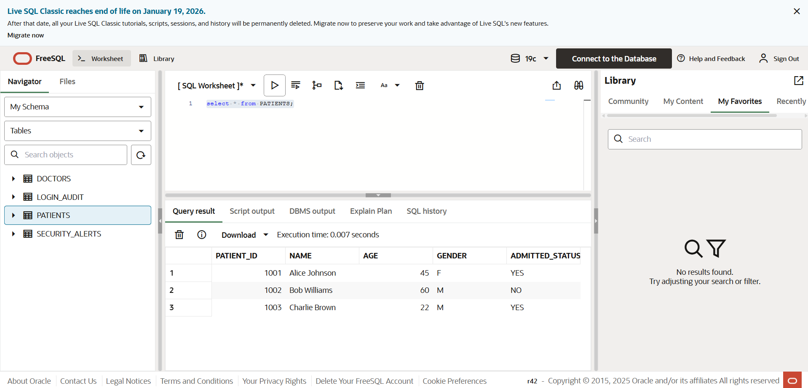
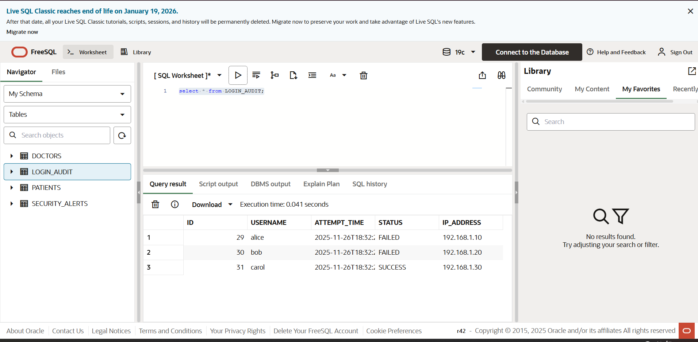
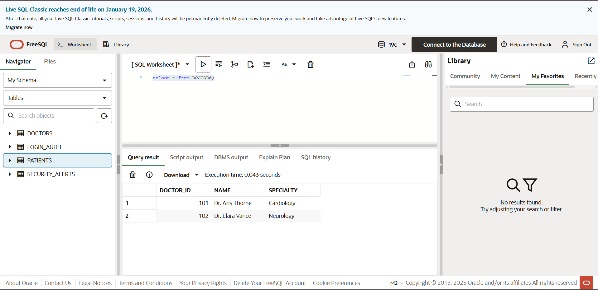

# PL/SQL Exercises - Scenarios: Triggers & Packages

### names
### Byiringiro Urban Bobola 27150
### setutamba heritier 27141
### Ngabo Tresor 27201
### Uwayo Nziza Ines
### Gatoya Cyuzuzo Grace
### Urumuli Ornella


## 📋 Assignment Overview

This repository contains complete solutions for **PL/SQL Exercises** focusing on **Triggers and Packages**. The assignment consists of two main scenarios that demonstrate advanced PL/SQL programming concepts including database triggers, packages, bulk processing, and security monitoring.

**Course:** INSY 8311 | Database development with PL/SQL  
**Academic Year:** 2025-2026, SEM II  
**Instructor:** Eric Maniraguha

---

## 📁 Project Structure

```
pl_sql_exercises/
│
├── README.md                          (This file - Main documentation)
│
├── question3/                         (Question 3: Security Login Monitoring)
│   ├── README.md                      (Question 3 specific documentation)
│   ├── 00_run_all.sql                 (Master script for Question 3)
│   ├── 01_create_login_audit_table.sql
│   ├── 02_create_security_alerts_table.sql
│   ├── 03_create_trigger.sql
│   ├── 04_create_procedures.sql
│   └── 05_test_scripts.sql
│
├── question4/                         (Question 4: Hospital Management Package)
│   ├── README.md                      (Question 4 specific documentation)
│   ├── 00_run_all.sql                 (Master script for Question 4)
│   ├── 01_create_patients_table.sql
│   ├── 02_create_doctors_table.sql
│   ├── 03_create_package_specification.sql
│   ├── 04_create_package_body.sql
│   └── 05_test_scripts.sql
│
└── Scenarios triggers & package in PLSQL.pdf  (Original assignment document)
```

---

## 🎯 Question 3: Security Login Monitoring System

### Overview
Implements a comprehensive security system that monitors login attempts and automatically generates alerts when users exceed failed login attempt thresholds.

### Key Features
- ✅ **Login Audit Tracking**: Records all login attempts (successful and failed)
- ✅ **Security Alerts**: Automatically creates alerts when users exceed 2 failed attempts
- ✅ **Trigger-Based Monitoring**: Real-time monitoring using database triggers
- ✅ **Email Notifications**: Optional email alert system for security team
- ✅ **Audit Trail**: Complete logging for compliance and investigation

### Components
1. **`login_audit` Table**: Stores all login attempts
2. **`security_alerts` Table**: Stores security alerts
3. **Trigger**: `trg_monitor_failed_logins` - Monitors failed attempts
4. **Procedures**: Email notifications, alert resolution
5. **Functions**: Helper functions for querying failed attempts

### Installation
```sql
-- Quick install (runs all components)
@question3/00_run_all.sql

-- Or install step by step
@question3/01_create_login_audit_table.sql
@question3/02_create_security_alerts_table.sql
@question3/03_create_trigger.sql
@question3/04_create_procedures.sql
@question3/05_test_scripts.sql
```

### Expected Behavior
- **1-2 failed attempts**: Only logged, no alert
- **3+ failed attempts**: Logged AND security alert created
- **Multiple failures same day**: Alert updated with latest count
- **Successful login**: Only logged, no alert triggered

📖 **Detailed Documentation**: See [question3/README.md](question3/README.md)

---

## 🏥 Question 4: Hospital Management Package with Bulk Processing

### Overview
Implements a PL/SQL package for hospital management that efficiently handles patient and doctor information with bulk processing capabilities.

### Key Features
- ✅ **Bulk Processing**: Efficient bulk insertion using FORALL
- ✅ **Patient Management**: Complete CRUD operations for patients
- ✅ **Admission Tracking**: Track patient admission and discharge
- ✅ **Doctor Management**: Add and manage doctor information
- ✅ **Cursor-Based Queries**: Efficient data retrieval using cursors
- ✅ **Transaction Management**: Proper COMMIT/ROLLBACK handling

### Components
1. **`patients` Table**: Stores patient information
2. **`doctors` Table**: Stores doctor information
3. **Package Specification**: `hospital_mgmt_pkg` with collection types
4. **Package Body**: Implementation with FORALL bulk processing
5. **Procedures & Functions**: Complete set of operations

### Package Procedures & Functions

#### Procedures
- `bulk_load_patients(p_patients)` - Bulk insert multiple patients
- `admit_patient(p_patient_id)` - Admit a patient
- `discharge_patient(p_patient_id)` - Discharge a patient
- `add_doctor(...)` - Add a new doctor

#### Functions
- `show_all_patients` - Returns cursor with all patients
- `count_admitted` - Returns count of admitted patients
- `get_patient_details(p_patient_id)` - Returns patient details by ID

### Installation
```sql
-- Quick install (runs all components)
@question4/00_run_all.sql

-- Or install step by step
@question4/01_create_patients_table.sql
@question4/02_create_doctors_table.sql
@question4/03_create_package_specification.sql
@question4/04_create_package_body.sql
@question4/05_test_scripts.sql
```

📖 **Detailed Documentation**: See [question4/README.md](question4/README.md)

---

## 🚀 Quick Start Guide

### Prerequisites
- Oracle Database 12c or higher (for IDENTITY columns)
- SQL*Plus or SQL Developer
- Appropriate database privileges:
  - CREATE TABLE
  - CREATE TRIGGER
  - CREATE PACKAGE
  - CREATE PROCEDURE
  - CREATE FUNCTION

### Installation Steps

#### Option 1: Install Everything
```sql
-- Install Question 3
@question3/00_run_all.sql

-- Install Question 4
@question4/00_run_all.sql
```

#### Option 2: Install Step by Step

**Question 3:**
```sql
@question3/01_create_login_audit_table.sql
@question3/02_create_security_alerts_table.sql
@question3/03_create_trigger.sql
@question3/04_create_procedures.sql
@question3/05_test_scripts.sql
```

**Question 4:**
```sql
@question4/01_create_patients_table.sql
@question4/02_create_doctors_table.sql
@question4/03_create_package_specification.sql
@question4/04_create_package_body.sql
@question4/05_test_scripts.sql
```

---

## 📊 Database Schema

### Question 3 Tables

#### `login_audit`
| Column | Type | Description |
|--------|------|-------------|
| audit_id | NUMBER | Primary key (auto-generated) |
| username | VARCHAR2(100) | Username who attempted login |
| attempt_time | TIMESTAMP | When the attempt occurred |
| status | VARCHAR2(20) | SUCCESS or FAILED |
| ip_address | VARCHAR2(50) | IP address (optional) |
| device_info | VARCHAR2(200) | Device information (optional) |

#### `security_alerts`
| Column | Type | Description |
|--------|------|-------------|
| alert_id | NUMBER | Primary key (auto-generated) |
| username | VARCHAR2(100) | User that triggered alert |
| failed_attempts | NUMBER | Number of failed attempts |
| alert_time | TIMESTAMP | When alert was created |
| alert_message | VARCHAR2(500) | Detailed message |
| contact_email | VARCHAR2(200) | Email for notification |
| resolved | CHAR(1) | Y/N status |

### Question 4 Tables

#### `patients`
| Column | Type | Description |
|--------|------|-------------|
| patient_id | NUMBER | Primary key (auto-generated) |
| patient_name | VARCHAR2(100) | Full name |
| age | NUMBER | Age (1-150) |
| gender | VARCHAR2(10) | M, F, Male, Female, Other |
| admitted_status | VARCHAR2(10) | YES/NO or Y/N |
| admission_date | DATE | Date admitted |
| discharge_date | DATE | Date discharged |
| created_date | TIMESTAMP | Record creation time |

#### `doctors`
| Column | Type | Description |
|--------|------|-------------|
| doctor_id | NUMBER | Primary key (auto-generated) |
| doctor_name | VARCHAR2(100) | Full name |
| specialty | VARCHAR2(100) | Medical specialty |
| phone_number | VARCHAR2(20) | Contact phone |
| email | VARCHAR2(100) | Contact email |
| created_date | TIMESTAMP | Record creation time |

---

## 📸 Screenshot Images

### Question 3 - Security Login Monitoring System





### Question 4 - Hospital Management Package



## 🔧 Key PL/SQL Concepts Demonstrated

### Question 3
- ✅ **Database Triggers**: AFTER INSERT triggers with WHEN clause
- ✅ **Exception Handling**: Comprehensive error handling
- ✅ **Transaction Management**: COMMIT/ROLLBACK
- ✅ **Stored Procedures**: Email notification procedures
- ✅ **Functions**: Helper query functions
- ✅ **Data Integrity**: CHECK constraints, indexes

### Question 4
- ✅ **PL/SQL Packages**: Specification and body separation
- ✅ **Collection Types**: Nested table types for bulk processing
- ✅ **FORALL Statement**: Efficient bulk DML operations
- ✅ **REF CURSORS**: Cursor-based data retrieval
- ✅ **Bulk Processing**: Performance optimization techniques
- ✅ **Transaction Management**: Proper COMMIT handling

---

## 📝 Usage Examples

### Question 3: Security Monitoring

```sql
-- Insert a failed login attempt
INSERT INTO login_audit (username, status, ip_address) 
VALUES ('user123', 'FAILED', '192.168.1.100');
COMMIT;

-- After 3 failed attempts, alert is automatically created
-- View alerts
SELECT * FROM security_alerts;

-- Resolve an alert
EXEC resolve_security_alert(1);

-- Get failed attempts count
SELECT get_failed_attempts_count('user123', TRUNC(SYSDATE)) FROM DUAL;
```

### Question 4: Hospital Management

```sql
-- Bulk load patients
DECLARE
    v_patients hospital_mgmt_pkg.patient_tab_type;
BEGIN
    v_patients := hospital_mgmt_pkg.patient_tab_type();
    v_patients.EXTEND(3);
    
    v_patients(1) := hospital_mgmt_pkg.patient_rec_type(
        'John Doe', 45, 'M', 'NO'
    );
    -- Add more patients...
    
    hospital_mgmt_pkg.bulk_load_patients(v_patients);
END;
/

-- Show all patients
DECLARE
    v_cursor SYS_REFCURSOR;
    -- variables...
BEGIN
    v_cursor := hospital_mgmt_pkg.show_all_patients;
    -- Fetch and display...
END;
/

-- Admit a patient
EXEC hospital_mgmt_pkg.admit_patient(1);

-- Count admitted patients
SELECT hospital_mgmt_pkg.count_admitted FROM DUAL;
```

---

## ✅ Testing

Both questions include comprehensive test scripts:

- **Question 3**: Tests 1-2 failed attempts, 3+ failed attempts, successful logins, different users
- **Question 4**: Tests bulk loading, displaying patients, counting admitted patients, admitting/discharging patients

Run test scripts:
```sql
@question3/05_test_scripts.sql
@question4/05_test_scripts.sql
```

---

## 🛠️ Troubleshooting

### Common Issues

1. **IDENTITY columns not supported**
   - **Solution**: Requires Oracle 12c or higher. For older versions, use sequences instead.

2. **Privilege errors**
   - **Solution**: Ensure you have CREATE TABLE, CREATE TRIGGER, CREATE PACKAGE privileges.

3. **Email functionality not working**
   - **Solution**: UTL_MAIL or UTL_SMTP must be configured. Check Oracle documentation for email setup.

4. **Package compilation errors**
   - **Solution**: Ensure tables are created before package specification, and specification before body.

5. **FORALL errors**
   - **Solution**: Verify collection is properly initialized and not empty.

### Error Codes

- `-20001`: Patient collection is empty or null
- `-20002`: Patient ID does not exist (admit_patient)
- `-20003`: Patient ID does not exist (discharge_patient)

---

## 📚 Best Practices Implemented

### Code Quality
- ✅ Comprehensive comments and documentation
- ✅ Proper error handling and exception management
- ✅ Consistent naming conventions
- ✅ Modular design with separate files

### Performance
- ✅ Indexes on frequently queried columns
- ✅ FORALL for bulk operations
- ✅ Cursor-based queries for large datasets
- ✅ Efficient trigger logic with WHEN clause

### Security
- ✅ Input validation
- ✅ Transaction safety (COMMIT/ROLLBACK)
- ✅ Audit trails
- ✅ Security monitoring

### Maintainability
- ✅ Separate files for each component
- ✅ Clear file naming conventions
- ✅ Comprehensive README files
- ✅ Test scripts included

---

## 📖 Additional Resources

- [Oracle PL/SQL Documentation](https://docs.oracle.com/en/database/oracle/oracle-database/)
- [PL/SQL Packages](https://docs.oracle.com/cd/E11882_01/appdev.112/e25519/packages.htm)
- [Database Triggers](https://docs.oracle.com/cd/E11882_01/appdev.112/e25519/triggers.htm)
- [Bulk Processing with FORALL](https://docs.oracle.com/cd/E11882_01/appdev.112/e25519/tuning.htm)

---

## 👤 Author

**Student Name**: [Your Name]  
**Course**: INSY 8311 | Database development with PL/SQL  
**Academic Year**: 2025-2026, SEM II  
**Instructor**: Eric Maniraguha

---

## 📄 License

This is an academic assignment submission. All code is provided for educational purposes.

---

## 🎓 Assignment Completion Checklist

### Question 3: Security Login Monitoring
- [x] `login_audit` table created with proper structure
- [x] `security_alerts` table created with proper structure
- [x] Trigger monitors failed login attempts
- [x] Alert generation when attempts exceed 2
- [x] Email notification system (optional)
- [x] Helper procedures and functions
- [x] Comprehensive test scripts

### Question 4: Hospital Management Package
- [x] `patients` table created
- [x] `doctors` table created
- [x] Package specification with collection type
- [x] Package body with FORALL bulk processing
- [x] All required procedures and functions
- [x] Proper transaction management
- [x] Comprehensive test scripts

---

## 📞 Support

For questions or issues:
1. Review the specific README files in `question3/` or `question4/` directories
2. Check the test scripts for usage examples
3. Review Oracle PL/SQL documentation
4. Consult with instructor

---

**Last Updated**: November 2025  
**Version**: 1.0

---

## 🙏 Acknowledgments

Special thanks to:
- Instructor Eric Maniraguha for guidance
- Oracle Corporation for PL/SQL documentation
- The academic community for best practices

---

**Blessings to you all!** 🙏

